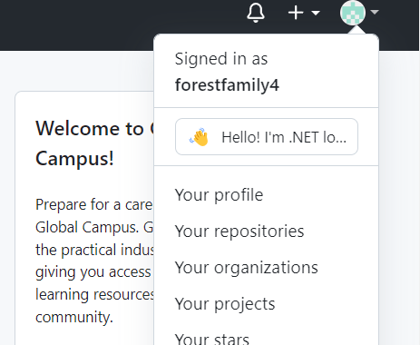
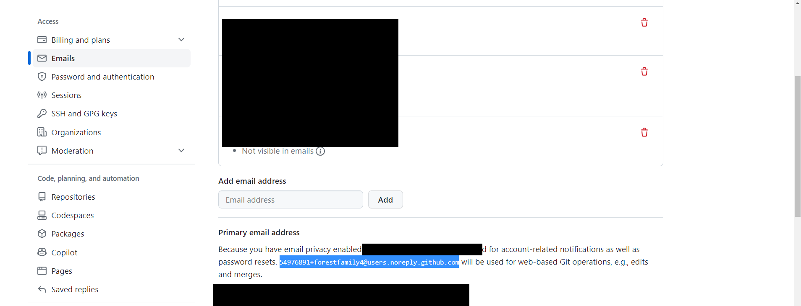

# Gitの環境構築

## Gitとは

GitHubと名前が似ていますが、この機能がGitHubの基盤となっています。

Gitはバージョン管理システムの一つで、ファイルの変更履歴を管理することができます。

## インストール

[Gitのダウンロードページ](https://git-scm.com/downloads)からインストーラーをダウンロードしてください。

<div><video controls src="../img/git1.mp4" muted="true"></video></div>

## Gitの設定

Gitをインストールしたら、Gitの設定を行います。

Gitの設定はコマンドラインから行うことができます。

コマンドラインを開いて、以下のコマンドを実行してください。

```bash
git config --global user.name "ユーザー名"
git config --global user.email "メールアドレス"
```


これがユーザー名です。



ここのメールアドレスをコピーしてください。

最終的には下のようなコマンドを実行することになります。

```bash
git config --global user.name "forestfamily4"
git config --global user.email "54976891+forestfamily4@users.noreply.github.com"
```

<div><video controls src="../img/git2.mp4" muted="true"></video></div>

## Gitの操作(コマンドでの操作も学んでおくべきですが、VSCodeの機能でも事足りるので飛ばしてもらっても構いません)

Gitはコマンドラインから操作することができます。

コマンドラインを開いて、以下のコマンドを実行してください。

```bash
git init
```

このコマンドを実行すると、Gitの管理下にあるファイルを作成することができます。

Gitの管理下にあるファイルは、以下のコマンドで確認することができます。

```bash
git status
```

このコマンドを実行すると、以下のような結果が表示されます。

```bash
On branch master

No commits yet

nothing to commit (create/copy files and use "git add" to track)
```

この状態では、Gitの管理下にあるファイルはありません。

Gitの管理下にあるファイルを作成するには、以下のコマンドを実行します。

```bash
git add ファイル名
```
ファイル名の部分には、実際に管理したいファイルの名前を入力してください。例えば、`file.txt`というファイルを追跡したい場合は、次のようにコマンドを実行します。

すべて追加したいときは、以下のコマンドを実行します。

```bash


```bash
git add file.txt
```

ファイルを追跡した後、ファイルの変更内容をコミットするために以下のコマンドを実行します。

```bash
git commit -m "コミットメッセージ"
```

コミットメッセージの部分には、変更内容の簡単な説明を書きます。例えば「ファイルを追加」というメッセージを書く場合は、次のようにコマンドを実行します。

```bash
git commit -m "ファイルを追加"
```

これで、変更内容がGitにコミットされました。コミットの履歴を確認するためには、以下のコマンドを実行します。

```bash
git log
```

また、リモートリポジトリ（GitHubなどのサービス）と連携して、変更内容を共有する場合は、以下のコマンドを使ってリモートリポジトリに変更内容をプッシュ（送信）します。

```bash
git remote add origin リモートリポジトリのURL
git push -u origin main
```

これで、ローカルの変更内容がリモートリポジトリに反映されます。

これらの基本的なGitコマンドを使って、ソースコードの変更履歴を管理し、チームメンバーやオープンソースプロジェクトと協力して作業することができます。

他にもGitにはさまざまなコマンドがありますが、主要なものは以下の通りです。

1. `git status`: 作業ディレクトリの変更状態を確認します。
2. `git diff`: 作業ディレクトリと最後のコミット間の変更差分を表示します。
3. `git branch`: 現在のブランチを一覧表示し、現在作業中のブランチを確認します。
4. `git checkout`: 他のブランチに切り替えたり、コミットの状態に戻したりします。
5. `git merge`: 異なるブランチの変更内容を統合（マージ）します。

これらのコマンドを使いこなすことで、効率的にソースコードの管理やチームでの開発ができるようになります。また、Gitの機能や他のコマンドについて学ぶためには、公式ドキュメントやチュートリアルを参考にすると良いでしょう。これらを使って状況に応じて適切なコマンドを実行したり、リモートリポジトリと連携したりすることで、プロジェクトをスムーズに進めることができます。