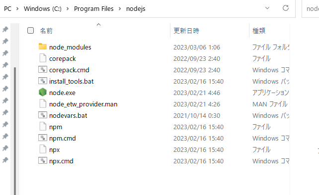

# Node.jsの環境構築

## Node.jsとは

Node.jsは、JavaScriptをサーバーサイドで実行するためのプラットフォームです。JavaScriptは、もともとブラウザ上で動作するために作られた言語ですが、Node.jsを使うことで、サーバーサイドで動作することができるようになります。

## インストール

https://nodejs.org/ja/download

ここでインストールしてください。LTS(Long Term Support)でいいです。特に設定をすることはないので、そのまま`next`を押し続けてください。

## Node.jsの機能

```bash
node <ファイル名>
```
Node.jsのファイルを実行することができます。

```bash
node -v
```
Node.jsのバージョンを確認することができます。

ここでnodejsが入っているフォルダを確認しましょう。
そのままインストールすれば、以下のフォルダに入っているはずです。

`C:\Program Files\nodejs`

これをエクスプローラーで開きます。




[ここ](./pc2.md#環境変数)でも説明しましたが、ここのフォルダにある

- node.exe
- npm.cmd
- npx.cmd

がコマンドとして実行されることになります。

## npm

npmはNode.jsのパッケージマネージャーです。パッケージマネージャーとは、プログラムをインストールしたり、アップデートしたり、アンインストールしたりするためのソフトウェアです。

npmはNode.jsをインストールすると一緒にインストールされます。

```bash
npm help
```

でnpmのヘルプを見ることができます。

```bash
npm i <パッケージ名>
```

パッケージをインストールすることができます。

```bash
npm i -g <パッケージ名>
```

`-g`をつけると、グローバルにインストールされます。グローバルにインストールされたパッケージは、どのフォルダにいても使うことができます。

`C:\Users\<ユーザー名>\AppData\Roaming\npm`

このフォルダを確認してみましょう。ここにグローバルにインストールされたパッケージが入っています。

Node.jsのパッケージの中にはコマンドラインで実行できるものがあります。例えば、`typescript`というパッケージをインストールすると、`tsc`というコマンドが使えるようになります。

## npx

npxは、npmのパッケージを実行するためのコマンドです。`npx <パッケージ名>`とすると、グローバルにインストールされていなくても、そのパッケージを実行することができます。

このパッケージ名がグローバルインストールされたものに限ると、npxは

`C:\Users\<ユーザー名>\AppData\Roaming\npm`

ここのフォルダにあるものを実行しているものだと言えます。

つまり、ここを環境変数として追加しておけば、どこからでも実行できるようになります。[ここ](./pc2.md#環境変数の変更方法)で説明しているので、追加しておいてください。

## yarn

yarnは、npmと同じくパッケージマネージャーです。npmよりも高速で、セキュリティも高いです。npmと同じように使うことができます。

```bash
yarn add <パッケージ名> -g
```

パッケージをインストールできます。`-g`をつけるとグローバルにインストールされます。

yarnについては後々使用することになります。

## パッケージの管理

パッケージの管理には、`package.json`というファイルを使います。このファイルには、プロジェクトの情報や、依存しているパッケージの情報が書かれています。

講義1で実際に作成していきます。