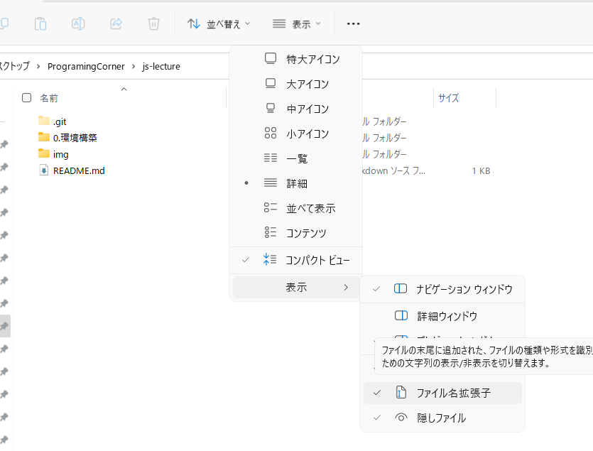
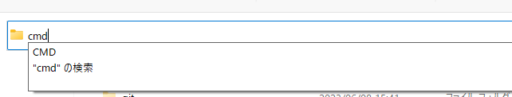
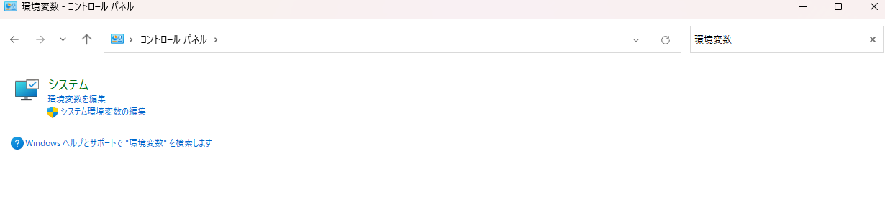
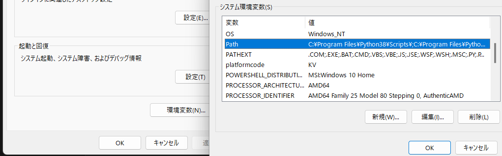

# pcの操作

## 拡張子を表示する

隠しファイルのオプションもオンにしておくことをお勧めします。

## コマンドプロンプト

WindowsのShell(コマンドを実行するもの)には二つの種類があります。

- コマンドプロンプト
- PowerShell

どちらを使っても困ることはありません。

### シェルを起動する方法

1. エクスプローラーの検索欄にcmd(powershell)と入力する

2. Enterする

### コマンドプロンプトの操作

- cd <ディレクトリ名>

  ディレクトリを移動する
- dir

    ディレクトリの中身を表示する
- mkdir <ディレクトリ名>    

    ディレクトリを作成する
- rmdir <ディレクトリ名>    

    ディレクトリを削除する
- del <ファイル名>

    ファイルを削除する
- echo <文字列>

    文字列を表示する
    
    echo %PATH% でパスになにが登録されているか確認できます。 `%変数%`

また、コマンドプロンプト上で範囲を選択し、右クリックすると、コピー、貼り付けができます。

「↑」ボタンを押すと前のコマンドをコピペすることができます。

## 環境変数

環境変数について理解するために、コマンドプロンプトで`explorer.exe`と打ってみましょう。もちろんお察しの通りエクスプローラーが開きます。

これの理由について考えてみましょう。

`echo %PATH%`で確認すると`C:\Windows`というパスが入っているはずです。

`C:\Windows`には`explorer.exe`があります。(確認してみてください。)

つまり、環境変数というのはコマンドプロンプトが入力されたコマンドからその名前をもつファイルを探してそれを実行している、と言えるでしょう。

環境変数を自分で登録することで面倒な処理をコマンドプロンプトで一括で実行できたりすることができますので、これの理解は非常に重要です。

### 環境変数の変更方法

コントロールパネルで環境変数と検索します。

下のシステム環境変数を開いてください。

このようにパスがありますね！

ここを編集し、保存することで永久にパスを保存することができます。

