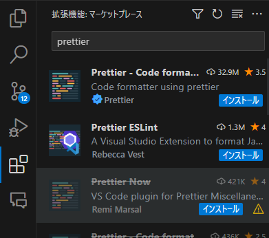
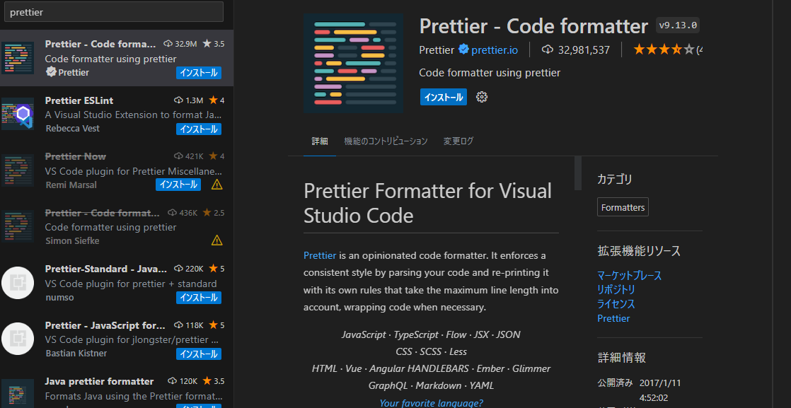
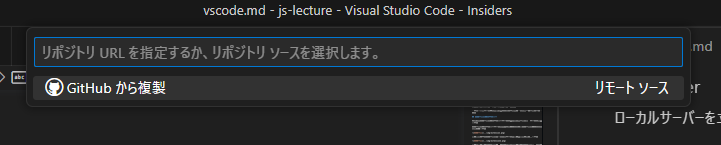
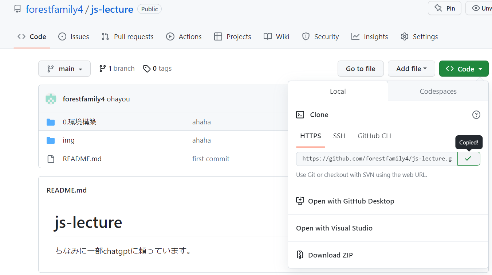
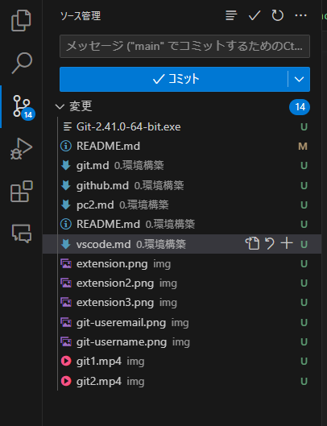
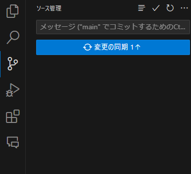
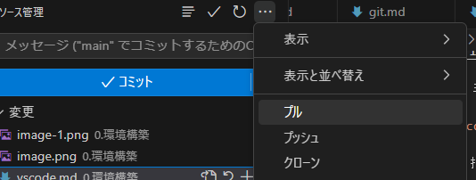

# VSCodeの環境構築

VSCodeとはVisual Studio Codeの略称で、Microsoftが開発したオープンソースのテキストエディタです。

## インストール

[VSCodeのダウンロードページ](https://code.visualstudio.com/download)からインストーラーをダウンロードしてください。

ダウンロードするときに、codeで開くというオプションを選択しておいてください。

## 拡張機能のインストール

VSCodeは拡張機能をインストールすることで、様々な機能を追加することができます。

拡張機能をインストールするには、左側のアイコンから拡張機能のアイコンをクリックします。

検索ボックスに拡張機能の名前を入力すると、検索結果が表示されます。

検索結果からインストールしたい拡張機能を選択し、インストールボタンをクリックするとインストールが開始されます。

おすすめの拡張機能を紹介します。

### Japanese Language Pack for Visual Studio Code

VSCodeの日本語化拡張機能です。

### Github Copilot Chat 

### Github Copilot Nightly

Copilotを使うには、[github.md](./github.md)のGitHub Educationを参考にしてください。

### Live Server

ローカルサーバーを立ち上げることができる拡張機能です。(htmlファイルの更新をすぐに確認できます。)

### 以下は講義がもう少し進んでからいれてもらう予定です。また今度追加します。

### Prettier - Code formatter

コードのフォーマットを行うことができる拡張機能です。

# コードの編集

講義1を参照してください。

# Gitの操作

[github.md](github.md)を参考にして作ったリポジトリをローカル(自分のPC)に落とし込みます。

## リポジトリのクローン

VSCodeの左側のアイコンからGitのアイコンをクリックします。

クローンをクリックします。

クローンしたいリポジトリのURLを入力します。

このURLはここで確認できます。

## コミット

コミットとはファイルの変更をGitHubに上げるということです。

メッセージ欄にコミットメッセージを入力します。

例えば、`first commit`と入力します。

コミットボタンを押します。

変更の同期を押します。(これはGitでいうところの`push`を意味しています。)

## プル

プルとはGitHubにあるファイルをローカルに落とし込むことです。

コミットができませんでしたというエラーが出た場合は、プルをしてください。

