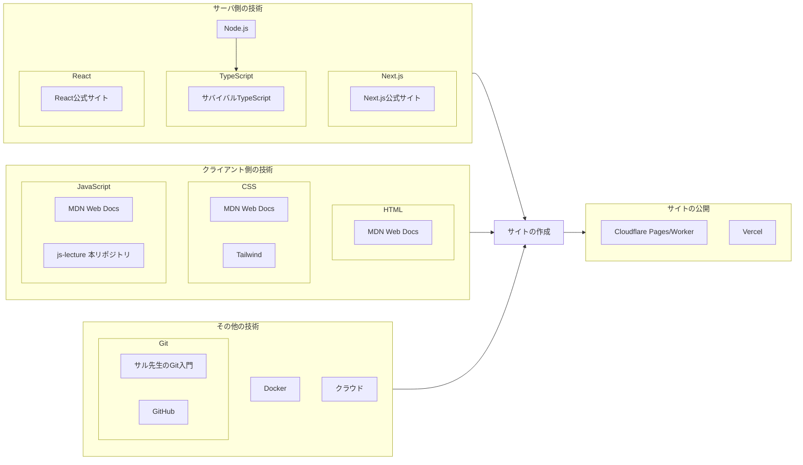

# R6 2 月新規向け

- リンク一覧
  "https://nextjs.org/docs"
  "https://ja.react.dev/learn"
  "https://developer.mozilla.org/ja/docs/Learn/HTML/Introduction_to_HTML"
  "https://developer.mozilla.org/ja/docs/Learn/CSS/First_steps"
  "https://tailwindcss.com/docs"
  "https://developer.mozilla.org/ja/docs/Web/JavaScript"
  "https://backlog.com/ja/git-tutorial/"
  "https://typescriptbook.jp/"
  "https://pages.cloudflare.com/"
  "https://vercel.com/"

## 2/8 の復習

- Next.js の開発サーバーを開始する

上のタブ一覧からターミナルを開き、
`npm run dev`
と入力する

> node,npm,npx コマンドについては、[nodejs.md](../0.環境構築/nodejs.md)を参照

- Next.js のページを作成する

`app/page.tsx`の中を編集する
