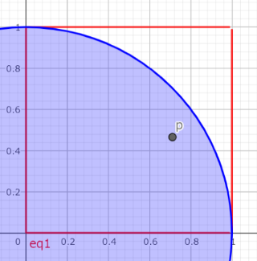

# 組み込みオブジェクト

## 解答例
[ヒント](../ヒント/B.ヒント.md)の内容を前提にして書いている内容が多いので、解説を読んでも分からないときはヒントも合わせて見てください。

### 大問1

1. 
```js
function getPi(n) {
  let count = 0;
  for (let i = 0; i < n; i++) {
    const x = Math.random();
    const y = Math.random();
    if (x ** 2 + y ** 2 <= 1) {
      count++;
    }
  }
  return 4 * count / n;
}

getPi(100); // 3.04
getPi(1000); // 3.088
getPi(10000); // 3.1376
```

- 円周率π=4×(円の中に入った点の数)/(正方形の内部に打った点の数)<br>
<br>
上のコードでは、このように赤枠の範囲内に点(x, y)を打って、それが青い円の中に入るかどうかを調べています。もし入っていたら、つまりx^2 + y^2 が1以下だったら`count`を1増やして円の中に入った点の数を記録しています。
`x`と`y`を宣言する式は同じですが、間違っても`const y = x;`などとはしないでください。結果が変わってしまいます(どのような値が出力されてしまうか考えてください)。

### 大問2

1. 
```js
// xはnumber型
function toInteger(x) {
  return Math.floor(x);
}

toInteger(3.14); // 3
toInteger(-3.14); // -4
toInteger(10); // 10
```

関数[`Math.floor()`](https://developer.mozilla.org/ja/docs/Web/JavaScript/Reference/Global_Objects/Math/floor)は数値を切り捨てる関数です。
引数が負の数のときの挙動を確認するために例えば`Math.floor(-3.14)`を実行すると、`-4`と出力される(省略していますが`console.log()`などで囲まないと出力されません)ことが確認できるので、この問題の条件にそのまま合うことが分かります。
もしも0に近づくように整数に変換する、つまり`toInteger(-3.14)`を実行したときに`-3`を返したいときは、正負で場合分けをする必要があります。

2. 
```js
function toNumber(x) {
  const num = Number(x);
  if (isNaN(num)) {
    return "数ではありません！";
  }
  return toInteger(num);
}

toNumber("100"); // 100
toNumber("42.195"); // 42
toNumber("hoge"); // "数ではありません！"
```

ヒントに書いた3つの関数を試してみましょう。<br>
|入力|出力|||
|--|----|----|----|
||[`parseInt()`](https://developer.mozilla.org/ja/docs/Web/JavaScript/Reference/Global_Objects/parseInt)|[`parseFloat()`](https://developer.mozilla.org/ja/docs/Web/JavaScript/Reference/Global_Objects/parseFloat)|[`Number()`](https://developer.mozilla.org/ja/docs/Web/JavaScript/Reference/Global_Objects/Number/Number)|
|"1"|1|1|1|
|"1.5"|1|1.5|1.5|
|"-3.14"|-3|-3.14|-3.14|
|"xyz"|NaN|NaN|NaN|
|"123xyz"|123|123|NaN|

`parseint()`は文字列を整数に変換する関数ですが、さっきと違って負の小数の文字列だったときは小数点以下を無視するような挙動になるので問題の条件に合いません。<br>
`parseFloat()`と`Number()`は小数も扱えて機能が似ていますが、`parseFloat()`は文字列の前から検索していって数値ではなくなったらそれまでの文字列を数値に変換して返すのに対して、`Number()`は文字列全体を数値に変換できるかどうかを調べてから変換するので、最後の例のような違いが出ます。他にも細かい違いがいくつかあるので、興味があれば調べてみてください。<br>
どちらの場合も、数値に変換できなければ`NaN`(Not a Number)を返します。解答例では、関数[`isNaN()`](https://developer.mozilla.org/ja/docs/Web/JavaScript/Reference/Global_Objects/isNaN)を使って、数値に変換できなかった時は`"数ではありません！"`という文字列を返しています。関数の意味を考えれば当然ですが、`isNaN()`は数値**ではない**ときに`true`を返すので注意しましょう。また、`num`が`NaN`かを確かめるために
```js
if (num === NaN) {
  //処理
}
```
としてしまうと残念ながらうまくいきません。```NaN === NaN```を実行してみると分かるように、`NaN`同士を比較しても`false`が返るのが原因です。詳しい仕様は適当に調べてください。
<br>
関数の最後では1問目で作った関数を使って整数に変換しています。<br>
なお、今回は分かりやすいように数値ではないときは文字列を返していますが、このような関数の実装はあまりよくありません。(ここからは長くなるので余裕があれば読んでください。)
この関数の返り値を利用して次の処理をするときに(実際に次の問題で利用します)、変換できなかったときの例外処理が面倒になります。例えば、

```js
const num = toNumber(x);
if (num === "数ではありません！") {
  //処理
}
```
このように例外処理ができますが、`if`の条件が冗長で、一文字でも間違えると動作しません。
もしくは、返り値が`string`型になるのは文字列でないときだけなので[`typeof`](https://developer.mozilla.org/ja/docs/Web/JavaScript/Reference/Operators/typeof)を使って
```js
if (typeof num === "string") {
  //処理
}
```
というようにも例外処理ができますが、これではわざわざ`"数ではありません！"`というような文字列を返す意味がありません。なので、変換できなかった時はそのまま`NaN`を返して
```js
const num = toNumber(x);
if (isNaN(num)) {
  //処理
}
```
というように`toNumber()`関数の外で例外処理をするか、いっそのこと[`throw`](https://developer.mozilla.org/ja/docs/Web/JavaScript/Reference/Statements/throw)を使ってエラーを吐くのが良いでしょう。

3. 

```js
function toHex(x) {
  const num = toNumber(x);
  if (num === "数ではありません！") {
    return num;
  }
  return num.toString(16);
}

toHex("100"); // "64"
toHex("42.195"); // "2a"
toHex("hoge"); // "数ではありません！"
```

ヒントに書いた通り、[`toString()`](https://developer.mozilla.org/ja/docs/Web/JavaScript/Reference/Global_Objects/Number/toString)の引数に数値を指定するとそれを基数(=何進数か)とした文字列に変換してくれます。
数値以外の文字列が渡された場合は`toNumber()`の返り値が`number`型ではなくなるので`if`を使って例外処理をしましょう。

4. 
```js
function toDecimal(x) {
  const num = parseInt(x, 16);
  if (isNaN(num)) {
    return "数ではありません！";
  }
  return num;
}

toDecimal("64"); // 100
toDecimal("2a"); // 42
toDecimal("hoge"); // "数ではありません！"
```

ヒントに書いた通り、[`parseInt()`](https://developer.mozilla.org/ja/docs/Web/JavaScript/Reference/Global_Objects/parseInt)の第二引数に基数を指定することで、第一引数の文字列を指定した基数の数値と解釈して変換してくれます。<br>
注意するべき点は、第2問で少し触れたように、関数`parseInt()`の仕様によって、例えば`toDecimal("4ω4")`を実行すると、`"数ではありません！"`ではなく`4`が返ってくることです。<br>
このような文字列にも対処する方法の一つには、[正規表現](https://developer.mozilla.org/ja/docs/Web/JavaScript/Guide/Regular_Expressions)を使って文字列に無効な文字が含まれていないかを確かめる方法があります。正規表現については今回は扱いませんが、以下に正規表現を使った解答例を挙げておきます。興味があれば調べてみてください。

```js
function toDecimal(x) {
  const num = parseInt(x, 16);
  if (isNaN(num) || !/^(|-)[0-9a-fA-F]+$/.test(x)) {
    return "数ではありません！";
  }
  return num;
}
```
